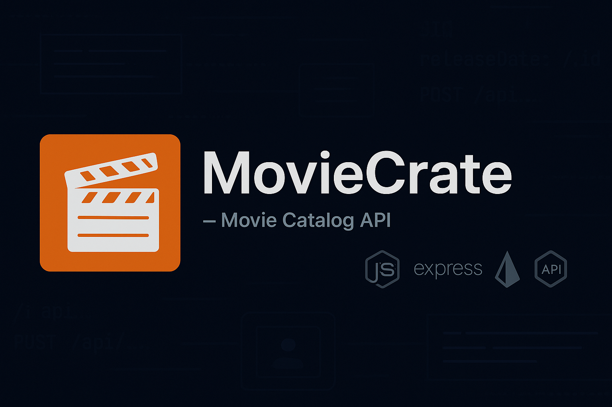

<p align="center">
  
</p>

# 🎬 MovieCrate – Your Personal Movie Management API

[](https://nodejs.org/)
[](https://supabase.io/)
[](https://developer.themoviedb.org/docs)
[](https://jestjs.io/)

> A feature-rich backend service built with Node.js, Express, Sequelize, PostgreSQL (Supabase), and TMDB API to manage movies, reviews, watchlists, wishlist and curated movie collections.

---

## 🚀 Project Features

**MovieCraft** is a feature-rich backend API that lets users:

- 🔍 Search for movies using the TMDB API
- 📑 Save movies to `Watchlist` and `Wishlist`
- 🗂️ Create and manage `Curated Lists` (e.g., "Top Horror Movies")
- 📝 Add `Reviews` and `Ratings` to movies
- 🎭 Filter movies by `Genre` and `Actor`
- 📊 Sort saved lists by `Rating` or `Release Year`
- 🏆 Fetch `Top 5 Rated` movies with detailed reviews

This project follows a scalable MVC pattern and includes proper error handling, validations, and unit/integration testing.

---

## 🛠️ Tech Stack

- **Node.js**, **Express.js**
- **PostgreSQL** via **Supabase**
- **Sequelize ORM** for DB operations
- **TMDB API** for movie data
- **Jest** Unit testing
- **Supertest** for API integration testing
- **Dotenv** for Environment config
- **MVC Architecture**

---

## 📁 Folder Structure

```

├── config/
│   └── config.js
├── migrations/
├── controllers/
│   └── movieController.js
│   └── curatedListController.js
├── services/
│   └── movieService.js
│   └── curatedListService.js
├── routes/
│   └── movieRoutes.js
│   └── curatedListRoutes.js
├── models/  ← Sequelize models (Movie, Watchlist, Wishlist, etc.)
├── **tests**/  ← All Jest + Supertest test cases
├── utils/
│   └── utils.js
├── .env
├── .gitignore
├── index.js

```

---

## 🧑‍💻 Setup Instructions

### 1️⃣ Clone the Repo

```bash
git clone https://github.com/ajmal92786/MovieCrate-Backend.git
cd MovieCrate-Backend
```

### 2️⃣ Install Dependencies

```bash
npm install
```

### 3️⃣ Set Environment Variables

Create a .env file in your root directory with the following:

```env
PORT=4000
DATABASE_URL=your_supabase_database_url
TMDB_API_KEY=your_tmdb_api_key
```

📁 Also provide a .env.example for contributors.

You can get a TMDB key from: [https://developer.themoviedb.org/docs](https://developer.themoviedb.org/docs)

---

### 4️⃣ DB Setup (PostgreSQL via Supabase or Local)

Update your DB credentials in `config/config.json` (or `.env` if you're using `sequelize-cli` + dotenv).

Run the migrations:

```bash
npx sequelize-cli db:migrate
```

---

### 5️⃣ Start the Server

```bash
npm start
```

Server will run on: `http://localhost:4000`

---

## 📬 API Endpoints

### 🎥 `/api/movies`

| Method | Route                                  | Description                         |
| ------ | -------------------------------------- | ----------------------------------- |
| GET    | `/api/movies/search?query=...`         | Search movies via TMDB              |
| POST   | `/api/movies/watchlist`                | Add movie to watchlist              |
| POST   | `/api/movies/wishlist`                 | Add movie to wishlist               |
| POST   | `/api/movies/curated-list`             | Add movie to curated list           |
| POST   | `/api/movies/:movieId/reviews`         | Add a review and rating             |
| GET    | `/api/movies/searchByGenreAndActor`    | Search by genre and actor           |
| GET    | `/api/movies/sort?list=...&sortBy=...` | Sort watchlist/wishlist/curatedlist |
| GET    | `/api/movies/top5`                     | Get top 5 movies with reviews       |

### 📑 `/api/curated-lists`

| Method | Route                               | Description                   |
| ------ | ----------------------------------- | ----------------------------- |
| POST   | `/api/curated-lists/`               | Create a curated list         |
| PUT    | `/api/curated-lists/:curatedListId` | Update curated list name/desc |

---

## 🚀 Deployment

MovieCrate is live and accessible at:

🔗 **API Base URL:**
[https://moviecrate-api.onrender.com](https://moviecrate-api.onrender.com)

> _(Deployed on Render — free-tier backend hosting)_

---

## 📬 Postman Collection

You can test all API endpoints using the Postman collection below:

📁 **Postman Link:**
[📨 MovieCrate API – Postman Collection](./docs/MovieCrate-Backend.postman_collection.json)

> _(Click to import in your Postman and explore all routes)_

> Tip: Use the base URL set as an environment variable in Postman for quick switching between local and production versions.

---

## 🧪 Testing

> Run all tests using:

```bash
npm run test
```

Includes:

- ✅ Route Integration Tests
- ✅ Controller Tests
- ✅ Service Tests
- ✅ Validation Tests

---

## 🌟 Highlights

- Clean MVC architecture
- Full integration with a third-party API
- Sequelize model associations
- Test-driven development
- Real-world use case (like Letterboxd / Netflix backend)

---

## 📸 Screenshots (Optional)

> Add Postman screenshots or terminal test output here for visual proof.

---

<!-- ## 🙋‍♂️ About Me

Hi, I’m **Mohd Ajmal Raza** – a backend developer passionate about building real-world APIs and solving problems with Node.js & PostgreSQL.
Connect with me on [LinkedIn](https://www.linkedin.com/in/mohd-ajmal-raza) or check out my [Portfolio](https://yourportfolio.com)
-->

## 🧑‍💻 Author

Made with 💚 by [**Mohd Ajmal Raza**](https://www.linkedin.com/in/mohd-ajmal-raza)

<!--* 🌐 Portfolio: [your-portfolio-link.com](https://your-portfolio-link.com) -->

- 🐙 GitHub: [@ajmal92786](https://github.com/ajmal92786)
- 📧 Email: [ajmalbly27@gmail.com](mailto:ajmalbly27@gmail.com)

---

## 📮 Feedback & Contributions

Feel free to raise issues, suggest features, or fork the project. I'm actively improving it. 😊

---

## 📜 License

This project is open-source and free to use under the [MIT License](LICENSE).

---
